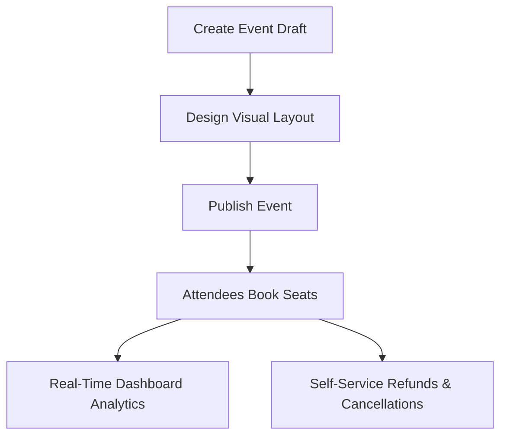

# 🚀 SVYNE Event Platform: Feature & Capability Showroom

Welcome to the ultimate feature guide for the **SVYNE Event Platform**. This document is designed for both marketing outreach and technical highlight sheets. It demonstrates how the platform solves modern event management challenges with state-of-the-art security, visual tools, and frictionless attendee experiences.

---

## 🌟 Core Value Propositions

| Benefit | How SVYNE Delivers | Marketing Hook |
| :--- | :--- | :--- |
| **Zero Password Friction** | Single-use Magic Links sent straight to the user's inbox. | *"No passwords to remember, no passwords to leak."* |
| **Visual Table Bookings** | Real-time, drag-and-drop table layouts with temporary locks. | *"Let attendees choose exactly where they sit."* |
| **Instant Self-Service Refunds** | Seamless Stripe integration for automated attendee refunds. | *"Stress-free cancellations that handle themselves."* |
| **Lightning-Fast Check-Ins** | On-site camera scanning of secure, unique QR codes. | *"Keep the entry lines moving at lightspeed."* |
| **Enterprise Governance** | Advanced developer panels for global pricing and fee overrides. | *"Granular monetization control at every level."* |

---

## 🎟️ Attendee Experience: Frictionless & Modern

Modern event-goers expect absolute simplicity. The SVYNE Attendee Portal delivers a premium, responsive experience from discovery to entry.

### 🔑 1. Passwordless Magic Link Authentication

* **Seamless Entry**: Users log in instantly by entering their email and clicking a secure link sent to their inbox.
* **Enhanced Security**: Eliminates password database vulnerabilities. Links have a 15-minute Time-To-Live (TTL) and are single-use.

> [!TIP]
> **Marketing Angle**: Highlighting passwordless login shows your brand cares about cutting-edge security and user convenience. Say goodbye to "Forgot Password" loops!

### 🔍 2. Event Discovery Engine

* **Dynamic Search & Filtering**: Attendee-facing portal allows instant sorting by Date, Price, or Title, and filtering by category or location.
* **Premium SEO Pages**: Every event automatically generates an SEO-friendly slug and structured JSON-LD schema so search engines index events immediately.

### 🛋️ 3. Interactive Visual Booking (Grid Layout)

* **Interactive Floor Plan**: Attendees see the venue's physical layout, table arrangements, shapes, and seating capacities.
* **Anti-Double-Booking Hold System**: Selecting a table holds it for 10 minutes, giving the user ample time to check out without losing their seat.
* **Open Layout Option**: Traditional capacity-based General Admission bookings for standard concerts or conferences.

### 👥 4. Group Bookings & Guest Invitations

* **Ticket Delegation**: Buyers purchasing a full table or multiple tickets can invite guests via email.
* **Claim Protocol**: Invited guests receive a secure link to claim their ticket, creating their own profiles and generating individual entry QR codes.

---

## 🏟️ Organizer (Admin) Suite: Total Operational Control

Empower event organizers with tools that turn complex floor plan logistics, ticketing, and analytics into simple, automated workflows.

### 🏗️ 1. Visual Floor Plan Editor

* **Drag-and-Drop Canvas**: Position round or square tables of various capacities and custom colors directly onto a grid.
* **Bulk Layout Templates**: Save time for large venues by inserting pre-configured layout templates.
* **State Protection**: The layout configuration automatically locks as soon as the first ticket is booked, preventing seat-assignment conflicts.

### 📊 2. Operations Dashboard

* **Financial Reporting**: Real-time sales charts showing gross revenue, net payouts, and platform service fees.
* **Event Health Monitors**: Track published vs. draft events, and monitor real-time entry rates as check-in begins.
* **Data Portability**: Instantly download complete attendee rosters and financial statements as **CSV** or **XLSX** spreadsheets.

---

## 🤳 Staff Portal: Rapid Entry Management

Ensure a smooth front-gate operation with a mobile-optimized terminal designed for volunteers and gate staff.

* **Camera-Driven QR Scanner**: Turn any smartphone or tablet camera into an entry ticket scanner.
* **Instant Seating Assignments**: Scanning a ticket displays a large, color-coded confirmation screen with the guest's designated table label (e.g., `VIP-3`).
* **Manual Roster Search**: Quickly find guests by name or email if they cannot access their digital ticket.
* **On-Site Ratios**: Live telemetry shows total checked-in guests vs. expected attendees at any given second.

---

## 🛠️ Developer & Platform Console: Enterprise Administration

The administrative engine that allows the platform owner to scale operations, adjust fees, and keep the application secure.

> [!IMPORTANT]
> **Platform Monetization**: Developers can override default commission rates globally, per-event, or per-table-type (e.g. charging a premium fee on VIP tables).

* **Centralized Log Hub**: Audit unhandled system errors, magic link email deliveries, and background worker status logs in one dashboard.
* **Role Hierarchy Controls**: Elevate users to `Staff`, `Admin`, or `Developer` roles instantly.
* **Security Hardened by Default**: Strict Content Security Policies (CSP), frame protection headers, device session hashing, and input validation guards against open redirects and injections.
