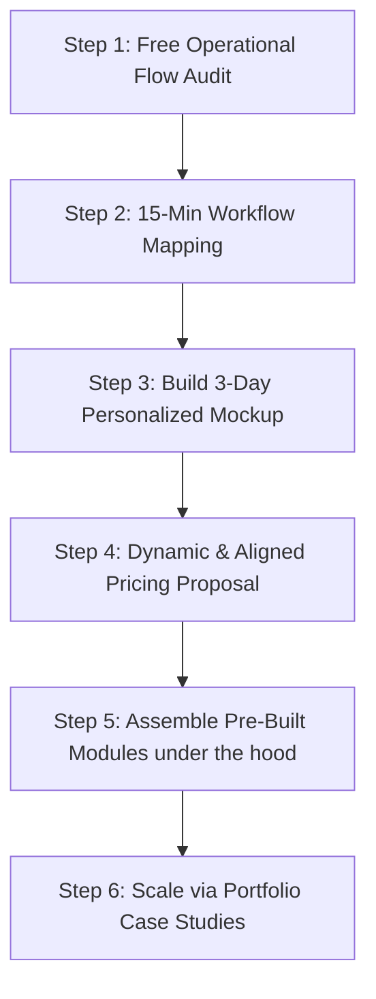

# svyne. — Strategic Local Growth Roadmap

This document outlines the step-by-step operational strategy for Siddh to launch, fund, and scale **svyne.** as a bespoke systems builder from Saraland/Chickasaw to Mobile County and across the state of Alabama.

---

## 1. The Core Philosophy: Bespoke Experience, Modular Engine

We have aligned on a high-trust, consultative model. **svyne.** is not a generic, self-service SaaS product. It is a custom systems building service powered by a shared library of pre-built, robust modules.

* **B.E.M.E. (Bespoke Experience, Modular Engine):** Every client receives a system configured specifically for their workflow. Under the hood, you reuse clean, decoupled core modules (CRM, Scheduling, Invoicing, Ticketing). This allows you to deliver enterprise-grade reliability at a fraction of the time and cost of a traditional custom software agency.
* **No Rigid SaaS Boxes:** You do not force clients to change their habits to fit generic software. You map the software to the way they already run.

---

## 2. Dynamic, Value-Aligned Pricing Models

Instead of a flat pricing grid, your pricing structures are designed dynamically around the client's specific business model, transaction types, and needs:

| Pricing Style | Best Fit | How it Works | Example |
| :--- | :--- | :--- | :--- |
| **Transaction/Revenue Share** | High-volume transactional flows | $0 setup, charging a small platform fee per transaction/ticket sold. Aligns your success directly with theirs. | Event Ticketing, Registration portals |
| **One-Time Flat Fee** | Simple visual fixes or static upgrades | Flat quote for a defined scope of work. | Fixing a broken website, rebuilding a mobile-fast homepage |
| **Hosting & Support Retainer** | Web hosting and continuous uptime | Small monthly fee to cover cloud server costs, backups, and support. | Basic Tier 1 hosting |
| **Hybrid Setup + Retainer** | Complete operational dashboards | One-time mapping & assembly fee (setup) + monthly retainer for support and minor tweaks. | Custom scheduling boards, SMS automations, pipeline tracking |

---

## 3. Playbook: From Zero to First 3 Clients

### Phase 1: The Outreach (The Free Audit)

1. Identify 10 local businesses on Thompson Blvd (Saraland) or highway fronts in Chickasaw.
2. Walk in during off-peak hours and offer a **Free 15-Minute Operational Flow Audit**.
3. Draw their current inputs (forms, phone calls, texts), system processes (spreadsheets, paper, whiteboards), and outputs (invoices, review asks) on paper, highlighting bottlenecks in red.

### Phase 2: The Hook (The 3-Day Personalized Mockup)

1. Spend 2–3 days configuring a simple, interactive frontend mockup in your React codebase using the client's logo, colors, and actual stages of work.
2. Meet again. Show them their own business dashboard on a laptop or tablet.
3. *Pitch:* "I've configured a mockup of your custom operations board. To get this live, let's look at a pricing structure that aligns with how your business makes money..."

### Phase 3: Tailored Proposal & Delivery

1. Propose the dynamic pricing structure that fits their context (e.g., transaction-based for ticketing, or a low-setup case-study model for a dashboard in exchange for referrals and video testimonials).
2. Assemble the pre-built backend modules under the hood, make client-specific tweaks in isolated extensions, and launch.
